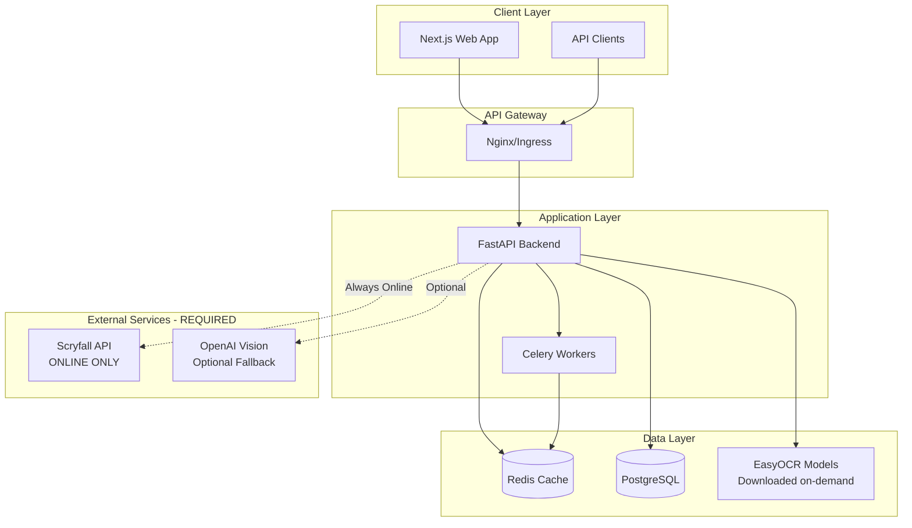

# 🏗️ Screen2Deck Architecture Documentation

## System Overview (v2.3.0 - ONLINE-ONLY)

Screen2Deck is a modern, cloud-native application built for 100% online operation. The system has been simplified by removing all offline capabilities, making deployment and maintenance easier while ensuring always-current card data.

## High-Level Architecture



## Component Architecture

### Frontend (Next.js)

```
webapp/
├── src/
│   ├── components/       # React components
│   │   ├── upload/      # Image upload UI
│   │   ├── results/     # OCR results display
│   │   └── export/      # Export options
│   ├── services/        # API integration
│   ├── hooks/           # Custom React hooks
│   └── utils/           # Utility functions
```

**Key Features:**
- Server-side rendering for SEO
- Progressive Web App capabilities
- Responsive design with Tailwind CSS
- Real-time updates via WebSocket

### Backend (FastAPI)

```
backend/
├── app/
│   ├── main.py                    # Application entry
│   ├── core/                      # Core modules
│   │   ├── config.py             # Settings management
│   │   ├── auth_middleware.py    # Authentication
│   │   ├── job_storage.py        # Redis job management
│   │   └── validation.py         # Input validation
│   ├── routers/                   # API endpoints
│   │   ├── auth_router.py        # Auth endpoints
│   │   ├── export_router.py      # Export endpoints
│   │   ├── health.py             # Health checks
│   │   └── metrics.py            # Prometheus metrics
│   ├── pipeline/                  # OCR pipeline
│   │   ├── preprocess.py         # Image preprocessing
│   │   ├── ocr.py                # EasyOCR integration
│   │   └── vision_fallback.py    # OpenAI Vision
│   ├── matching/                  # Card matching
│   │   ├── fuzzy.py              # Fuzzy matching
│   │   ├── scryfall_cache.py     # SQLite cache
│   │   └── scryfall_client.py    # API client
│   └── exporters/                 # Export formats
│       ├── mtga.py
│       ├── moxfield.py
│       ├── archidekt.py
│       └── tappedout.py
```

## Data Flow Architecture

### OCR Processing Pipeline

```
1. Image Upload
   ↓
2. Validation & Sanitization
   ├─→ Check MIME type
   ├─→ Verify dimensions
   └─→ Calculate SHA256 hash
   ↓
3. Idempotency Check
   ├─→ Found: Return cached result
   └─→ Not found: Continue
   ↓
4. Job Creation (Redis)
   ↓
5. Image Preprocessing
   ├─→ Grayscale conversion
   ├─→ Adaptive thresholding
   ├─→ Noise reduction
   └─→ Contrast enhancement
   ↓
6. OCR Processing
   ├─→ EasyOCR (primary)
   └─→ Vision API (fallback)
   ↓
7. Card Recognition
   ├─→ Parse text lines
   ├─→ Extract quantities
   └─→ Identify card names
   ↓
8. Scryfall Matching
   ├─→ Check SQLite cache
   ├─→ Fuzzy matching
   └─→ API fallback
   ↓
9. Result Normalization
   ├─→ Attach Scryfall IDs
   ├─→ Validate deck rules
   └─→ Fill missing data
   ↓
10. Export Generation
```

### Authentication Flow

```
1. User Registration
   ├─→ Validate input
   ├─→ Hash password (bcrypt)
   └─→ Store in database
   
2. Login
   ├─→ Verify credentials
   ├─→ Generate JWT tokens
   ├─→ Return access + refresh
   
3. API Request
   ├─→ Extract token
   ├─→ Verify signature
   ├─→ Check expiration
   └─→ Extract permissions
   
4. Token Refresh
   ├─→ Validate refresh token
   ├─→ Generate new access token
   └─→ Maintain session
```

## Database Schema

### PostgreSQL (Users & Auth)

```sql
-- Users table
CREATE TABLE users (
    id UUID PRIMARY KEY DEFAULT uuid_generate_v4(),
    username VARCHAR(50) UNIQUE NOT NULL,
    email VARCHAR(255) UNIQUE NOT NULL,
    hashed_password VARCHAR(255) NOT NULL,
    is_active BOOLEAN DEFAULT true,
    is_admin BOOLEAN DEFAULT false,
    created_at TIMESTAMP DEFAULT CURRENT_TIMESTAMP,
    updated_at TIMESTAMP DEFAULT CURRENT_TIMESTAMP
);

-- API Keys table
CREATE TABLE api_keys (
    id UUID PRIMARY KEY DEFAULT uuid_generate_v4(),
    user_id UUID REFERENCES users(id),
    key_hash VARCHAR(64) UNIQUE NOT NULL,
    name VARCHAR(100),
    permissions JSONB,
    last_used TIMESTAMP,
    created_at TIMESTAMP DEFAULT CURRENT_TIMESTAMP,
    expires_at TIMESTAMP
);

-- Audit Log
CREATE TABLE audit_log (
    id BIGSERIAL PRIMARY KEY,
    user_id UUID REFERENCES users(id),
    action VARCHAR(50),
    resource VARCHAR(100),
    ip_address INET,
    user_agent TEXT,
    created_at TIMESTAMP DEFAULT CURRENT_TIMESTAMP
);
```

### Redis (Job Storage)

```python
# Job structure
{
    "job:<uuid>": {
        "id": "550e8400-e29b-41d4-a716",
        "state": "completed",
        "progress": 100,
        "created_at": "2024-01-01T00:00:00Z",
        "updated_at": "2024-01-01T00:01:00Z",
        "image_hash": "sha256...",
        "user_id": "user-123",
        "result": {...},
        "error": null
    }
}

# Indexes
"idx:hash:<sha256>": ["job-id-1", "job-id-2"]
"idx:user:<user-id>": {"job-id": timestamp}
```

### SQLite (Scryfall Cache)

```sql
-- Cards cache
CREATE TABLE cards (
    id TEXT PRIMARY KEY,
    name_norm TEXT NOT NULL,
    name_printed TEXT NOT NULL,
    oracle_id TEXT,
    scryfall_id TEXT UNIQUE,
    set_code TEXT,
    collector_number TEXT,
    image_uris TEXT,
    updated_at TIMESTAMP,
    cache_hit_count INTEGER DEFAULT 0
);

-- Indexes for performance
CREATE INDEX idx_name_norm ON cards(name_norm);
CREATE INDEX idx_oracle_id ON cards(oracle_id);
CREATE INDEX idx_updated_at ON cards(updated_at);
```

## Scaling Architecture

### Horizontal Scaling

```yaml
# Kubernetes HPA configuration
apiVersion: autoscaling/v2
kind: HorizontalPodAutoscaler
metadata:
  name: backend-hpa
spec:
  scaleTargetRef:
    apiVersion: apps/v1
    kind: Deployment
    name: backend
  minReplicas: 2
  maxReplicas: 10
  metrics:
  - type: Resource
    resource:
      name: cpu
      target:
        type: Utilization
        averageUtilization: 70
  - type: Resource
    resource:
      name: memory
      target:
        type: Utilization
        averageUtilization: 80
```

### Load Balancing

```nginx
upstream backend {
    least_conn;
    server backend-1:8080 weight=1;
    server backend-2:8080 weight=1;
    server backend-3:8080 weight=1;
    
    keepalive 32;
}
```

### Caching Strategy

```
┌─────────────┐
│   Browser   │ ← Browser Cache (1h)
└─────────────┘
       ↓
┌─────────────┐
│     CDN     │ ← CDN Cache (24h)
└─────────────┘
       ↓
┌─────────────┐
│    Nginx    │ ← Proxy Cache (5m)
└─────────────┘
       ↓
┌─────────────┐
│   FastAPI   │ ← Application Cache
└─────────────┘
       ↓
┌─────────────┐
│    Redis    │ ← Result Cache (24h)
└─────────────┘
       ↓
┌─────────────┐
│   SQLite    │ ← Scryfall Cache (7d)
└─────────────┘
```

## Performance Optimization

### Image Processing

```python
# Multi-variant preprocessing
variants = [
    original,
    grayscale,
    threshold_adaptive,
    threshold_otsu,
    enhanced_contrast
]

# Parallel OCR processing
results = await asyncio.gather(*[
    process_variant(v) for v in variants
])

# Select best result
best = max(results, key=lambda r: r.confidence)
```

### Database Optimization

```python
# Connection pooling
engine = create_async_engine(
    DATABASE_URL,
    pool_size=20,
    max_overflow=40,
    pool_pre_ping=True,
    pool_recycle=3600
)

# Query optimization
SELECT c.* FROM cards c
WHERE c.name_norm = $1
  AND c.updated_at > NOW() - INTERVAL '7 days'
LIMIT 1;
```

### API Response Optimization

```python
# Response compression
app.add_middleware(GZipMiddleware, minimum_size=1000)

# JSON serialization with orjson
from fastapi.responses import ORJSONResponse
app = FastAPI(default_response_class=ORJSONResponse)

# Pagination
@app.get("/api/jobs")
async def list_jobs(
    limit: int = Query(10, le=100),
    offset: int = Query(0, ge=0)
):
    return await get_jobs(limit, offset)
```

## Monitoring Architecture

### Metrics Collection

```
┌──────────────┐
│  Application │
│   Metrics    │
└──────────────┘
       ↓
┌──────────────┐
│  Prometheus  │ ← Scrapes /metrics
└──────────────┘
       ↓
┌──────────────┐
│   Grafana    │ ← Visualization
└──────────────┘
```

### Distributed Tracing

```
┌──────────────┐
│ OpenTelemetry│
│    SDK       │
└──────────────┘
       ↓
┌──────────────┐
│ OTLP Exporter│
└──────────────┘
       ↓
┌──────────────┐
│   Jaeger     │ ← Trace Storage
└──────────────┘
```

### Key Metrics

| Metric | Target | Alert Threshold |
|--------|--------|-----------------|
| API Latency (p95) | <500ms | >1000ms |
| OCR Processing Time | <5s | >10s |
| Error Rate | <1% | >5% |
| Cache Hit Rate | >80% | <60% |
| CPU Usage | <70% | >85% |
| Memory Usage | <80% | >90% |

## Security Architecture

### Defense Layers

```
1. Network Security
   ├─→ Firewall rules
   ├─→ DDoS protection
   └─→ TLS termination

2. Application Security
   ├─→ Authentication middleware
   ├─→ Rate limiting
   ├─→ Input validation
   └─→ Security headers

3. Data Security
   ├─→ Encryption at rest
   ├─→ Encryption in transit
   └─→ Secret management

4. Container Security
   ├─→ Non-root users
   ├─→ Read-only filesystem
   └─→ Security scanning
```

## Deployment Architecture

### Docker Compose (Development)

```yaml
services:
  backend:
    build: ./backend
    environment:
      - APP_ENV=development
    volumes:
      - ./backend:/app
    
  webapp:
    build: ./webapp
    environment:
      - NEXT_PUBLIC_API_URL=http://backend:8080
    
  redis:
    image: redis:7-alpine
    
  postgres:
    image: postgres:15-alpine
```

### Kubernetes (Production)

```yaml
apiVersion: apps/v1
kind: Deployment
metadata:
  name: backend
spec:
  replicas: 3
  strategy:
    type: RollingUpdate
    rollingUpdate:
      maxSurge: 1
      maxUnavailable: 0
  template:
    spec:
      containers:
      - name: backend
        image: screen2deck/backend:latest
        resources:
          requests:
            memory: "256Mi"
            cpu: "250m"
          limits:
            memory: "512Mi"
            cpu: "500m"
        livenessProbe:
          httpGet:
            path: /health/live
            port: 8080
        readinessProbe:
          httpGet:
            path: /health/ready
            port: 8080
```

## Development Workflow

### Local Development

```bash
# Start dependencies
docker-compose up -d redis postgres

# Backend development
cd backend
python -m venv venv
source venv/bin/activate
pip install -r requirements.txt
python -m app.main

# Frontend development
cd webapp
npm install
npm run dev
```

### CI/CD Pipeline

```yaml
name: CI/CD Pipeline
on: [push, pull_request]

jobs:
  test:
    - Run unit tests
    - Run integration tests
    - Check code coverage
    
  security:
    - Scan dependencies
    - Run SAST analysis
    - Check for secrets
    
  build:
    - Build Docker images
    - Push to registry
    
  deploy:
    - Deploy to staging
    - Run E2E tests
    - Deploy to production
```

## Future Architecture Considerations

### Planned Improvements

1. **Event-Driven Architecture**
   - Implement event sourcing
   - Add message queue (RabbitMQ/Kafka)
   - Enable real-time notifications

2. **Microservices Split**
   - Separate OCR service
   - Independent export service
   - Dedicated auth service

3. **Enhanced Caching**
   - Implement GraphQL with DataLoader
   - Add edge caching with Cloudflare
   - Optimize database queries

4. **Machine Learning Pipeline**
   - Custom OCR model training
   - Card detection improvements
   - User behavior analytics

---

**Last Updated**: August 2024
**Architecture Contact**: tech@screen2deck.com