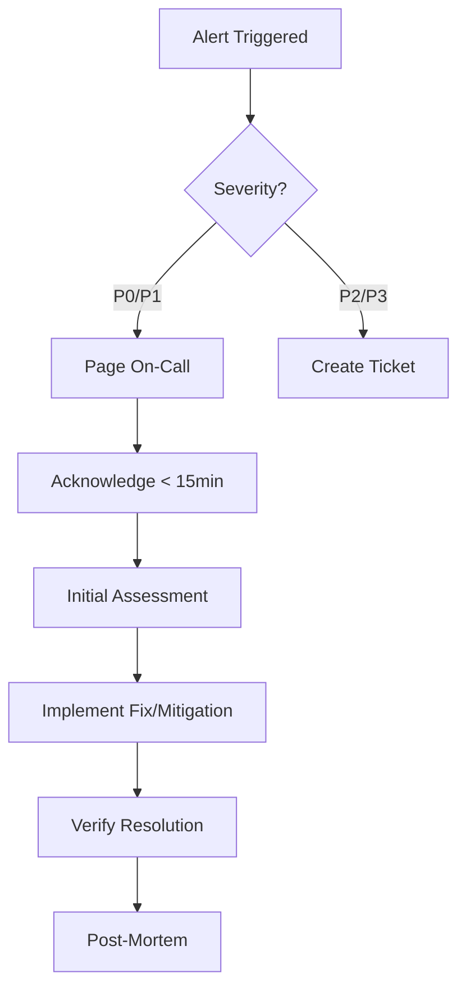

# 📘 Screen2Deck Operational Runbook

## 🚨 Emergency Contacts

| Role | Contact | Availability |
|------|---------|--------------|
| Primary On-Call | ops@screen2deck.com | 24/7 |
| Secondary On-Call | backup-ops@screen2deck.com | 24/7 |
| Security Team | security@screen2deck.com | Business hours |
| Infrastructure | infra@screen2deck.com | Business hours |

## 🔥 Critical Incident Response

### Severity Levels

| Level | Description | Response Time | Examples |
|-------|-------------|---------------|----------|
| **P0** | Complete outage | < 15 min | Site down, data breach |
| **P1** | Major degradation | < 30 min | Auth broken, OCR failing |
| **P2** | Partial degradation | < 2 hours | Slow performance, export issues |
| **P3** | Minor issue | < 24 hours | UI glitch, non-critical bug |

### Incident Response Workflow



## 🔧 Common Operations

### Starting the Application

#### Docker Deployment
```bash
# Start all services
docker-compose -f docker-compose.prod.yml up -d

# Verify services are running
docker-compose ps

# Check health endpoints
curl http://localhost:8080/health
curl http://localhost:8080/health/ready
```

#### Manual Deployment
```bash
# 1. Start Redis
redis-server --requirepass $REDIS_PASSWORD

# 2. Start PostgreSQL
pg_ctl start -D /var/lib/postgresql/data

# 3. Start backend
cd backend
source venv/bin/activate
python -m app.main

# 4. Start frontend
cd webapp
npm run start:prod
```

### Stopping the Application

```bash
# Docker
docker-compose down

# Manual - Graceful shutdown
# 1. Stop accepting new requests
curl -X POST http://localhost:8080/admin/maintenance/enable

# 2. Wait for active jobs to complete (max 5 min)
watch 'redis-cli LLEN ocr:queue'

# 3. Stop services
pkill -SIGTERM -f "python -m app.main"
systemctl stop redis
systemctl stop postgresql
```

### Restarting Services

```bash
# Full restart
docker-compose restart

# Rolling restart (zero downtime)
kubectl rollout restart deployment/backend -n screen2deck

# Individual service restart
docker-compose restart backend
# OR
systemctl restart screen2deck-backend
```

## 🔍 Troubleshooting Guide

### Issue: Site is Down

**Symptoms**: 
- Users report site unreachable
- Health check failing

**Investigation**:
```bash
# 1. Check service status
docker-compose ps
systemctl status screen2deck-*

# 2. Check logs
docker-compose logs --tail=100 backend
journalctl -u screen2deck-backend -n 100

# 3. Check port binding
netstat -tulpn | grep 8080
lsof -i :8080

# 4. Test connectivity
curl -v http://localhost:8080/health
```

**Resolution**:
```bash
# Quick fix - restart services
docker-compose restart

# If port conflict
kill -9 $(lsof -t -i:8080)
docker-compose up -d

# If resource issue
docker system prune -a
docker-compose up -d --force-recreate
```

### Issue: OCR Processing Failing

**Symptoms**:
- Jobs stuck in queue
- Timeout errors
- Low accuracy results

**Investigation**:
```bash
# 1. Check job queue
redis-cli LLEN ocr:queue
redis-cli LRANGE ocr:queue 0 10

# 2. Check recent errors
grep ERROR /var/log/screen2deck/backend.log | tail -20

# 3. Test OCR directly
curl -X POST http://localhost:8080/api/ocr/test \
  -H "Authorization: Bearer $ADMIN_TOKEN"

# 4. Check resource usage
docker stats backend
htop
```

**Resolution**:
```bash
# Clear stuck jobs
redis-cli DEL ocr:queue
redis-cli --scan --pattern "job:*" | xargs redis-cli DEL

# Restart OCR service
docker-compose restart backend

# Increase resources if needed
docker-compose down
# Edit docker-compose.yml to increase memory/cpu
docker-compose up -d
```

### Issue: Authentication Errors

**Symptoms**:
- Users can't login
- JWT errors in logs
- 401 responses

**Investigation**:
```bash
# 1. Check JWT configuration
grep JWT_SECRET /app/.env

# 2. Verify Redis connectivity
redis-cli ping
redis-cli --scan --pattern "session:*" | head

# 3. Test auth endpoint
curl -X POST http://localhost:8080/api/auth/login \
  -H "Content-Type: application/x-www-form-urlencoded" \
  -d "username=test&password=test"

# 4. Check token validation
jwt decode $TOKEN --secret=$JWT_SECRET
```

**Resolution**:
```bash
# Fix JWT secret mismatch
export JWT_SECRET_KEY=$(python -c "import secrets; print(secrets.token_urlsafe(32))")
echo "JWT_SECRET_KEY=$JWT_SECRET_KEY" >> .env
docker-compose restart backend

# Clear invalid sessions
redis-cli --scan --pattern "session:*" | xargs redis-cli DEL

# Reset user password
python scripts/reset_password.py --username=user@example.com
```

### Issue: High Memory Usage

**Symptoms**:
- Container using >1GB RAM
- OOM kills
- Slow response times

**Investigation**:
```bash
# 1. Check memory usage
docker stats --no-stream
free -h
ps aux | sort -rn -k 4 | head

# 2. Analyze memory leaks
docker exec backend python -m tracemalloc

# 3. Check cache size
redis-cli INFO memory
redis-cli DBSIZE

# 4. Review logs for memory errors
dmesg | grep -i "out of memory"
journalctl -u docker --since "1 hour ago" | grep OOM
```

**Resolution**:
```bash
# Quick fix - restart with memory cleanup
docker-compose down
docker system prune -a
docker-compose up -d

# Clear Redis cache
redis-cli FLUSHDB

# Adjust memory limits
# Edit docker-compose.yml
mem_limit: 1g
mem_reservation: 512m

# Enable swap if needed
sudo fallocate -l 2G /swapfile
sudo chmod 600 /swapfile
sudo mkswap /swapfile
sudo swapon /swapfile
```

### Issue: Database Connection Errors

**Symptoms**:
- "Connection pool exhausted"
- Timeout errors
- Can't connect to PostgreSQL

**Investigation**:
```bash
# 1. Check PostgreSQL status
systemctl status postgresql
pg_isready

# 2. Check connections
psql -U postgres -c "SELECT count(*) FROM pg_stat_activity;"
psql -U postgres -c "SELECT * FROM pg_stat_activity WHERE state = 'idle';"

# 3. Test connectivity
psql -U screen2deck -d screen2deck -c "SELECT 1;"

# 4. Check configuration
grep DATABASE /app/.env
cat /etc/postgresql/*/main/postgresql.conf | grep max_connections
```

**Resolution**:
```bash
# Kill idle connections
psql -U postgres -c "SELECT pg_terminate_backend(pid) FROM pg_stat_activity WHERE state = 'idle' AND state_change < NOW() - INTERVAL '10 minutes';"

# Increase connection pool
# Edit postgresql.conf
max_connections = 200
# Edit .env
DATABASE_POOL_SIZE=20
DATABASE_MAX_OVERFLOW=40

# Restart services
systemctl restart postgresql
docker-compose restart backend
```

## 📊 Monitoring & Alerts

### Health Checks

```bash
# Basic health
curl http://localhost:8080/health

# Detailed health
curl http://localhost:8080/health/detailed

# Component health
curl http://localhost:8080/health/ready

# Metrics endpoint
curl http://localhost:8080/metrics
```

### Key Metrics to Monitor

| Metric | Normal Range | Alert Threshold | Action |
|--------|--------------|-----------------|--------|
| API Latency (p95) | <500ms | >1000ms | Scale up |
| Error Rate | <1% | >5% | Investigate logs |
| CPU Usage | <70% | >85% | Scale horizontally |
| Memory Usage | <80% | >90% | Restart/scale |
| Redis Queue Length | <100 | >500 | Add workers |
| Cache Hit Rate | >80% | <60% | Check cache |

### Alert Configuration

```yaml
# Prometheus alerts
groups:
  - name: screen2deck
    rules:
      - alert: HighErrorRate
        expr: rate(http_requests_total{status=~"5.."}[5m]) > 0.05
        for: 5m
        labels:
          severity: critical
        annotations:
          summary: "High error rate detected"
          
      - alert: HighMemoryUsage
        expr: container_memory_usage_bytes{name="backend"} / container_spec_memory_limit_bytes > 0.9
        for: 10m
        labels:
          severity: warning
```

## 🔄 Maintenance Procedures

### Database Backup

```bash
# Manual backup
pg_dump -U screen2deck -d screen2deck > backup_$(date +%Y%m%d).sql

# Automated backup (cron)
0 2 * * * pg_dump -U screen2deck -d screen2deck | gzip > /backups/db_$(date +\%Y\%m\%d).sql.gz

# Restore from backup
psql -U screen2deck -d screen2deck < backup_20240817.sql
```

### Redis Backup

```bash
# Save snapshot
redis-cli BGSAVE

# Check last save
redis-cli LASTSAVE

# Backup RDB file
cp /var/lib/redis/dump.rdb /backups/redis_$(date +%Y%m%d).rdb

# Restore
systemctl stop redis
cp /backups/redis_20240817.rdb /var/lib/redis/dump.rdb
systemctl start redis
```

### Log Rotation

```bash
# Configure logrotate
cat > /etc/logrotate.d/screen2deck << EOF
/var/log/screen2deck/*.log {
    daily
    rotate 7
    compress
    delaycompress
    notifempty
    create 640 screen2deck screen2deck
    sharedscripts
    postrotate
        docker-compose restart backend
    endscript
}
EOF

# Manual rotation
logrotate -f /etc/logrotate.d/screen2deck
```

### Certificate Renewal

```bash
# Check certificate expiry
openssl x509 -in /etc/ssl/certs/screen2deck.crt -noout -dates

# Renew Let's Encrypt certificate
certbot renew --quiet

# Verify renewal
certbot certificates

# Reload nginx
nginx -s reload
```

## 🚀 Deployment Procedures

### Blue-Green Deployment

```bash
# 1. Deploy to green environment
kubectl apply -f k8s/deployment-green.yaml

# 2. Test green environment
curl http://green.screen2deck.com/health

# 3. Switch traffic to green
kubectl patch service screen2deck -p '{"spec":{"selector":{"version":"green"}}}'

# 4. Monitor for issues (5 minutes)
watch kubectl logs -l version=green --tail=20

# 5. If issues, rollback
kubectl patch service screen2deck -p '{"spec":{"selector":{"version":"blue"}}}'

# 6. If successful, update blue
kubectl apply -f k8s/deployment-blue.yaml
```

### Rolling Update

```bash
# Update image
kubectl set image deployment/backend backend=screen2deck/backend:v2.1.0

# Monitor rollout
kubectl rollout status deployment/backend

# Check pods
kubectl get pods -l app=backend

# Rollback if needed
kubectl rollout undo deployment/backend
```

### Database Migration

```bash
# 1. Backup current database
pg_dump -U screen2deck -d screen2deck > pre_migration_backup.sql

# 2. Put site in maintenance mode
curl -X POST http://localhost:8080/admin/maintenance/enable

# 3. Run migrations
cd backend
alembic upgrade head

# 4. Verify migration
psql -U screen2deck -d screen2deck -c "\dt"

# 5. Disable maintenance mode
curl -X POST http://localhost:8080/admin/maintenance/disable

# 6. Test functionality
python scripts/test_migration.py
```

## 📝 Logging & Debugging

### Log Locations

| Component | Location | Command |
|-----------|----------|---------|
| Backend | `/var/log/screen2deck/backend.log` | `tail -f /var/log/screen2deck/backend.log` |
| Frontend | `/var/log/screen2deck/frontend.log` | `tail -f /var/log/screen2deck/frontend.log` |
| Nginx | `/var/log/nginx/access.log` | `tail -f /var/log/nginx/access.log` |
| PostgreSQL | `/var/log/postgresql/postgresql.log` | `tail -f /var/log/postgresql/postgresql.log` |
| Redis | `/var/log/redis/redis-server.log` | `tail -f /var/log/redis/redis-server.log` |
| Docker | `docker logs <container>` | `docker-compose logs -f backend` |

### Debug Mode

```bash
# Enable debug logging
export LOG_LEVEL=DEBUG
export DEBUG=true
docker-compose restart backend

# Live debugging with Python
docker exec -it backend python
>>> from app.main import app
>>> from app.core.config import settings
>>> settings.dict()

# Trace requests
curl -H "X-Debug: true" http://localhost:8080/api/ocr/status/123
```

### Performance Profiling

```bash
# CPU profiling
py-spy record -o profile.svg -- python -m app.main

# Memory profiling
memray run python -m app.main
memray flamegraph output.bin

# API load testing
locust -f tests/load_test.py --host=http://localhost:8080 --users=100 --spawn-rate=10

# Database query analysis
psql -U screen2deck -c "SELECT * FROM pg_stat_statements ORDER BY total_time DESC LIMIT 10;"
```

## 🛡️ Security Procedures

### Security Scan

```bash
# Dependency scan
pip-audit requirements.txt
npm audit

# Container scan
trivy image screen2deck/backend:latest

# OWASP ZAP scan
docker run -t owasp/zap2docker-stable zap-baseline.py -t http://localhost:8080

# Check for secrets
gitleaks detect --source=. --verbose
```

### Incident Response

```bash
# 1. Isolate affected system
iptables -A INPUT -s suspicious_ip -j DROP

# 2. Capture evidence
tcpdump -i eth0 -w incident_$(date +%Y%m%d).pcap
tar -czf logs_backup.tar.gz /var/log/screen2deck/

# 3. Review access logs
grep suspicious_ip /var/log/nginx/access.log
grep "401\|403" /var/log/screen2deck/backend.log

# 4. Reset compromised credentials
python scripts/reset_all_passwords.py
redis-cli FLUSHDB  # Clear all sessions

# 5. Apply security patches
apt-get update && apt-get upgrade
pip install --upgrade -r requirements.txt
```

## 📋 Checklists

### Daily Checks
- [ ] Check health endpoints
- [ ] Review error rates in metrics
- [ ] Check disk space
- [ ] Review backup completion
- [ ] Check certificate expiry (weekly)

### Before Deployment
- [ ] Run all tests
- [ ] Backup database
- [ ] Check resource availability
- [ ] Notify team of maintenance window
- [ ] Prepare rollback plan

### After Incident
- [ ] Confirm service restoration
- [ ] Notify stakeholders
- [ ] Document timeline
- [ ] Create post-mortem
- [ ] Update runbook with learnings

## 🔗 Useful Commands Reference

```bash
# Quick health check
curl -s http://localhost:8080/health | jq .

# Get current job count
redis-cli LLEN ocr:queue

# Check active connections
netstat -an | grep ESTABLISHED | wc -l

# View recent errors
docker-compose logs --tail=50 backend | grep ERROR

# Database connection count
psql -U postgres -c "SELECT count(*) FROM pg_stat_activity;"

# Clear all Redis keys (CAUTION!)
redis-cli FLUSHALL

# Restart everything
docker-compose down && docker-compose up -d

# Emergency shutdown
docker-compose kill

# Force cleanup
docker system prune -a --volumes
```

---

**Last Updated**: August 2024  
**Runbook Version**: 1.0.0  
**Contact**: ops@screen2deck.com