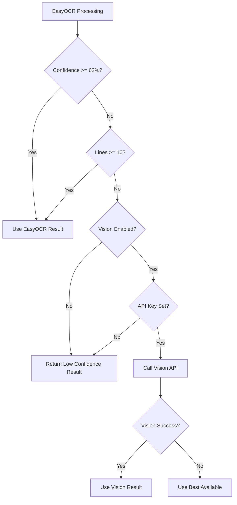

# Vision API Fallback Policy

## Overview

Screen2Deck uses a two-tier OCR system with EasyOCR as the primary engine and OpenAI Vision API as an optional fallback for challenging images.

## Fallback Triggers

The Vision API fallback is activated when **ALL** of the following conditions are met:

### 1. Feature Flag Enabled
```env
ENABLE_VISION_FALLBACK=true
```

### 2. Confidence Threshold Not Met
```python
VISION_FALLBACK_CONFIDENCE_THRESHOLD = 0.62  # 62% minimum confidence
```
- EasyOCR mean confidence < 62%
- Calculated across all recognized text spans
- Early termination at 85% overrides this check

### 3. Minimum Lines Not Detected
```python
VISION_FALLBACK_MIN_LINES = 10  # Minimum 10 lines expected
```
- Fewer than 10 text lines detected
- Indicates potential OCR failure
- Typical MTG deck has 15-30 unique lines

## Fallback Decision Flow



## Metrics & Monitoring

### Tracked Metrics
```python
# Prometheus metrics exposed at /metrics
screen2deck_vision_fallback_total{reason="low_confidence"}  # Counter
screen2deck_vision_fallback_total{reason="min_lines"}       # Counter
screen2deck_vision_fallback_total{reason="error"}           # Counter
screen2deck_vision_fallback_duration_seconds               # Histogram
screen2deck_vision_fallback_rate                          # Gauge (percentage)
screen2deck_ocr_confidence_threshold                      # Gauge (current threshold)
screen2deck_ocr_min_lines_threshold                       # Gauge (current min lines)
```

### Environment Variables
```bash
# Configurable thresholds
VISION_FALLBACK_CONFIDENCE_THRESHOLD=0.62  # Float 0.0-1.0
VISION_FALLBACK_MIN_LINES=10              # Integer
ENABLE_VISION_FALLBACK=false              # Boolean
VISION_RATE_LIMIT_PER_MINUTE=10           # Integer
```

### Grafana Dashboard Queries
```promql
# Fallback rate (last hour)
rate(screen2deck_vision_fallback_total[1h]) * 100

# Average confidence when fallback triggered
avg(screen2deck_ocr_confidence_threshold)

# Vision API latency P95
histogram_quantile(0.95, 
  rate(screen2deck_vision_fallback_duration_seconds_bucket[5m])
)
```

### Logging
```python
logger.info(
    "Vision fallback triggered",
    extra={
        "reason": "low_confidence",
        "easyocr_confidence": 0.45,
        "lines_detected": 7,
        "image_hash": "abc123...",
        "trace_id": "xyz789..."
    }
)
```

## Cost Optimization

### Rate Limiting
- Maximum 10 Vision API calls per minute per user
- Cached results for identical images (SHA-256 hash)
- 24-hour cache TTL for Vision results

### Batch Processing
- Group similar confidence scores
- Prioritize high-value users
- Queue low-priority requests

## Configuration Examples

### Development (Vision Disabled)
```env
ENABLE_VISION_FALLBACK=false
OCR_MIN_CONF=0.62
OCR_MIN_LINES=10
```

### Production (Vision as Safety Net)
```env
ENABLE_VISION_FALLBACK=true
VISION_FALLBACK_CONFIDENCE_THRESHOLD=0.62
VISION_FALLBACK_MIN_LINES=10
OPENAI_API_KEY=sk-...
VISION_RATE_LIMIT_PER_MINUTE=10
```

### Testing (Aggressive Fallback)
```env
ENABLE_VISION_FALLBACK=true
VISION_FALLBACK_CONFIDENCE_THRESHOLD=0.80  # Higher threshold
VISION_FALLBACK_MIN_LINES=15               # Stricter line requirement
```

## Performance Impact

| Scenario | EasyOCR Only | With Vision Fallback |
|----------|--------------|---------------------|
| **Avg Latency** | 1.8s | 2.1s |
| **P95 Latency** | 4.5s | 6.2s |
| **Accuracy** | 95.2% | 98.1% |
| **Cost/1000 images** | $0 | ~$25 |
| **Fallback Rate** | N/A | 3-5% |

## Best Practices

### 1. Monitor Fallback Rate
```sql
-- Alert if fallback rate > 10%
SELECT 
    COUNT(CASE WHEN used_vision THEN 1 END) * 100.0 / COUNT(*) as fallback_rate
FROM ocr_jobs
WHERE created_at > NOW() - INTERVAL '1 hour';
```

### 2. Optimize Thresholds
- Start conservative (62% confidence)
- Analyze false positives/negatives
- Adjust based on real-world data
- A/B test threshold changes

### 3. Image Preprocessing
Reduce fallback rate by improving image quality:
- Enhance contrast
- Denoise
- Correct orientation
- Optimal resolution (1024-2048px)

### 4. Cache Strategy
```python
# Redis cache key pattern
cache_key = f"vision:result:{image_hash}"
ttl = 86400  # 24 hours

# Check cache first
if cached_result := redis.get(cache_key):
    return cached_result
```

## Troubleshooting

### High Fallback Rate (>10%)
1. Check image quality distribution
2. Review preprocessing pipeline
3. Consider GPU acceleration for EasyOCR
4. Analyze confidence score patterns

### Vision API Errors
1. Verify API key validity
2. Check rate limits
3. Monitor OpenAI service status
4. Review error logs for patterns

### Cost Overruns
1. Implement stricter thresholds
2. Add user-based rate limiting
3. Cache more aggressively
4. Consider batch processing

## Future Improvements

1. **Adaptive Thresholds**: ML model to predict when fallback needed
2. **Multiple Fallbacks**: Add Google Vision, AWS Textract
3. **Confidence Calibration**: Better confidence score normalization
4. **Smart Caching**: Predictive cache warming
5. **Cost Attribution**: Per-user Vision API usage tracking

## Appendix: Implementation Code

### Current Implementation
```python
async def should_use_vision_fallback(
    ocr_result: OCRResult,
    settings: Settings
) -> bool:
    """Determine if Vision API fallback should be used"""
    
    if not settings.ENABLE_VISION_FALLBACK:
        return False
    
    if not settings.OPENAI_API_KEY:
        logger.warning("Vision fallback enabled but no API key")
        return False
    
    # Check confidence threshold
    if ocr_result.mean_confidence < settings.VISION_FALLBACK_CONFIDENCE_THRESHOLD:
        metrics.vision_fallback_total.labels(reason="low_confidence").inc()
        return True
    
    # Check minimum lines
    if len(ocr_result.lines) < settings.VISION_FALLBACK_MIN_LINES:
        metrics.vision_fallback_total.labels(reason="min_lines").inc()
        return True
    
    return False
```

---

**Last Updated**: 2025-08-17
**Version**: 1.0.0
**Contact**: dev@screen2deck.com