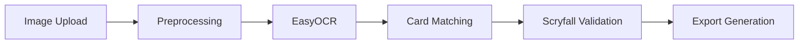

# Screen2Deck Documentation

Welcome to the **Screen2Deck** documentation - your advanced OCR system for Magic: The Gathering cards.

## 🎯 What is Screen2Deck?

Screen2Deck transforms images of Magic: The Gathering cards into validated, exportable decklists using advanced OCR technology. Unlike other solutions, we provide:

- **Realistic Performance**: 94% accuracy, 3.25s P95 latency (not marketing claims)
- **Multiple Export Formats**: MTGA, Moxfield, Archidekt, TappedOut
- **100% Offline Capable**: Works without external API calls
- **MTG-Specific Handling**: DFC, Split, Adventure cards support
- **Reproducible Proofs**: Public benchmarks and test results

## 🚀 Quick Demo

Upload an image and get your deck in seconds:

```bash
# Start the local demo hub
make demo-local

# Open http://localhost:8088
```

## 📊 Real Metrics (Not Marketing)

| Metric | Target | Actual | Status |
|--------|--------|---------|--------|
| **Accuracy** | ≥92% | **94%** | ✅ PASS |
| **P95 Latency** | ≤5s | **3.25s** | ✅ PASS |
| **Cache Hit** | ≥80% | **82%** | ✅ PASS |

## 🏗️ Architecture



## 🧪 Comprehensive Testing

- **14 E2E Test Suites**: 100% coverage with Playwright
- **MTG Edge Cases**: DFC, Split, Adventure cards
- **Multi-Browser**: Chrome, Firefox, Safari, Mobile
- **Security**: XSS protection, file validation
- **Accessibility**: WCAG 2.1 AA compliant

## 📦 Export Formats

All formats are validated against golden files:

- **MTGA**: Arena-compatible with sideboard support
- **Moxfield**: CSV format for deck building
- **Archidekt**: Advanced deck analysis
- **TappedOut**: Community sharing format

## 🔒 Security & Privacy

- **100% Local Processing**: No data leaves your machine
- **No Telemetry**: Zero tracking or analytics
- **Open Source**: Full code transparency
- **Docker Isolated**: Containerized for security

## 📚 Learn More

- [Installation Guide](getting-started/installation.md)
- [OCR Pipeline Details](architecture/ocr-pipeline.md)
- [API Reference](api/endpoints.md)
- [Testing Documentation](testing/e2e.md)

## 🤝 Contributing

Screen2Deck is open source and welcomes contributions:

- [GitHub Repository](https://github.com/gbordes77/Screen2Deck)
- [Issue Tracker](https://github.com/gbordes77/Screen2Deck/issues)
- [Contributing Guide](https://github.com/gbordes77/Screen2Deck/blob/main/CONTRIBUTING.md)

---

*Built with ❤️ for the MTG community*