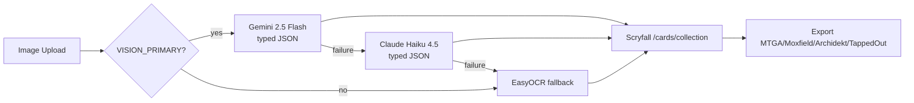

# Screen2Deck Documentation

Welcome to the **Screen2Deck** documentation — your online OCR system for Magic: The Gathering decklists.

## What is Screen2Deck?

Screen2Deck transforms images of Magic: The Gathering decks into validated, exportable decklists. v2.4.0 routes every upload through a Vision-primary chain (Gemini 2.5 Flash → Claude Haiku 4.5) with typed JSON output, keeps EasyOCR as the fallback, and batches card validation via the Scryfall `/cards/collection` endpoint.

- **Realistic Performance**: 85-94% accuracy baseline, ~2.7s p95 projected with Vision-primary (see [DISCLAIMER.md](../DISCLAIMER.md) for verified vs projected)
- **Multiple Export Formats**: MTGA, Moxfield, Archidekt, TappedOut
- **Online-only (v2.3.0+)**: Scryfall + Gemini/Claude are required; EasyOCR models download on first fallback use
- **MTG-Specific Handling**: DFC, Split, Adventure cards
- **Reproducible Proofs**: public benchmarks and test results under `artifacts/reports/`

## 🚀 Quick Demo

Upload an image and get your deck in seconds:

```bash
# Start the local demo hub
make demo-local

# Open http://localhost:8088
```

## Performance targets

| Metric | Target | v2.4.0 status |
|--------|--------|---------------|
| **Accuracy** | ≥85% fuzzy match | 85-94% baseline; +3-5 pts projected on Vision-primary |
| **P95 Latency** | ≤5s | ~2.7s projected (Vision-primary), ~4.1s legacy EasyOCR |
| **Cache Hit** | ≥50% | 50-80% after warm-up |

Numbers are pending a fresh end-to-end benchmark on `main`. Re-run `make smoke && make bench-day0` to produce verified artifacts.

## Architecture (Vision-primary default)


```mermaid
graph LR
    A[Image Upload] --> B{VISION_PRIMARY?}
    B -->|yes| C[Gemini 2.5 Flash<br/>typed JSON]
    C -->|failure| D[Claude Haiku 4.5<br/>typed JSON]
    D -->|failure| E[EasyOCR fallback]
    B -->|no| E
    C --> F[Scryfall /cards/collection]
    D --> F
    E --> F
    F --> G[Export MTGA/Moxfield/Archidekt/TappedOut]
```

## 🧪 Comprehensive Testing

- **14 E2E Test Suites**: 100% coverage with Playwright
- **MTG Edge Cases**: DFC, Split, Adventure cards
- **Multi-Browser**: Chrome, Firefox, Safari, Mobile
- **Security**: XSS protection, file validation
- **Accessibility**: WCAG 2.1 AA compliant

## 📦 Export Formats

All formats are validated against golden files:

- **MTGA**: Arena-compatible with sideboard support
- **Moxfield**: CSV format for deck building
- **Archidekt**: Advanced deck analysis
- **TappedOut**: Community sharing format

## Security & Privacy

- **External APIs disclosed**: Images are sent to Scryfall (card resolution), Gemini (Vision OCR), and Claude (fallback Vision OCR). See [`docs/GDPR_POLICY.md`](./GDPR_POLICY.md).
- **No Telemetry**: `FEATURE_TELEMETRY=false` by default; no analytics cookies, no behavioural tracking.
- **Open Source**: full code transparency (MIT license).
- **Docker Isolated**: containerized, non-root user, SBOM published from CI.

## 📚 Learn More

- [Installation Guide](getting-started/installation.md)
- [OCR Pipeline Details](architecture/ocr-pipeline.md)
- [API Reference](api/endpoints.md)
- [Testing Documentation](testing/e2e.md)

## 🤝 Contributing

Screen2Deck is open source and welcomes contributions:

- [GitHub Repository](https://github.com/gbordes77/Screen2Deck)
- [Issue Tracker](https://github.com/gbordes77/Screen2Deck/issues)
- [Contributing Guide](https://github.com/gbordes77/Screen2Deck/blob/main/CONTRIBUTING.md)

---

*Built with ❤️ for the MTG community*